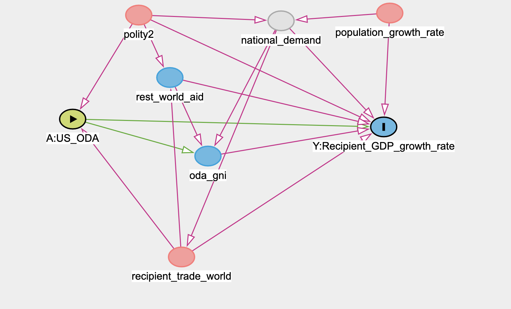

# Data Preprocessing

```{r}
# Loading
library(dplyr)
library(naniar)
library(lme4)
library(ggplot2)
library(dagitty)
library(merTools) #we use this package because we need to use the "predictInterval" function
```

`ODA`: official development assistance
`OOF`: Other Official Flows
`aid_total`:total aid
`polity2`:Recipient Polity Score,  "-10 (hereditary monarchy) to +10 (consolidated democracy)"
`oda_gni`: ODA in percentage in gross national income
`gdp_percap_real`:Recipient GDP Per Capita

`population`: Recipient Population (a-b)/b
`recipient_trade_world`:Recipient Total Trade with World
`gdp_per_growth`: GDP per capita growth (a-b)/b
`GDP_total_growth`: GDP total growth

```{r pressure, echo=FALSE}
aid = read.csv("processed.csv")
head(aid)
```
First, let's visualize the distribution of the missing data.
```{r}
vis_miss(aid)
vis_miss(aid,cluster = TRUE)
```
we decide to drop the observations that have missing values for the following reason:
1. "MNAR: Missing Not at Random - the missing is not random, it correlates with unobservable characteristics unknown to a researcher."
2. we still have 80% data left.
```{r}
aid = aid %>%
  na.omit(aid)
```

```{r}
dag <- dagitty("
dag {
bb=\"0,0,1,1\"
\"A:US_ODA\" [exposure,pos=\"0.272,0.239\"]
\"Y:Recipient_GDP_growth_rate\" [outcome,pos=\"0.672,0.254\"]
national_demand [latent,pos=\"0.540,0.050\"]
oda_gni [pos=\"0.446,0.310\"]
polity2 [pos=\"0.357,0.039\"]
population_growth_rate [pos=\"0.651,0.028\"]
recipient_trade_world [pos=\"0.412,0.504\"]
rest_world_aid [pos=\"0.397,0.159\"]
\"A:US_ODA\" -> \"Y:Recipient_GDP_growth_rate\"
\"A:US_ODA\" -> oda_gni
national_demand -> \"Y:Recipient_GDP_growth_rate\"
national_demand -> oda_gni
national_demand -> recipient_trade_world
oda_gni -> \"Y:Recipient_GDP_growth_rate\"
polity2 -> \"A:US_ODA\"
polity2 -> \"Y:Recipient_GDP_growth_rate\"
polity2 -> national_demand
polity2 -> rest_world_aid
population_growth_rate -> \"Y:Recipient_GDP_growth_rate\"
population_growth_rate -> national_demand
recipient_trade_world -> \"A:US_ODA\"
recipient_trade_world -> \"Y:Recipient_GDP_growth_rate\"
recipient_trade_world -> rest_world_aid
rest_world_aid -> \"Y:Recipient_GDP_growth_rate\"
rest_world_aid -> oda_gni
}
")
plot(dag)
```


# Causal Discovery


# Mixed Effect Model

## What is random effect and fixed effect?

## Our Model


# Regression Analysis
## Initial visualization 
```{r}
# ggplot(data = aid, aes(x = US_aid_total, y = GDP_total_growth))+
#   geom_point()
```

## The impact of U.S Foreign Aid on recipients

## Naive Model
```{r}
#US_lm <- lm(as.numeric(GDP_total_growth) ~ US_aid_total, data = aid)
```

## Mixed effect Model
```{r}
# US <- lmer(as.numeric(GDP_total_growth) ~ US_aid_total + (1 | country), data = aid)
# summary(US)
# confint(US)
```
```{r}
#re <- ranef(US)$country
```


```{r}
# predictInterval(US)   # for various model predictions, possibly with new data
# 
# REsim(US)             # mean, median and sd of the random effect estimates
# 
# plotREsim(REsim(US))  # plot the interval estimates
```

## Prediction
```{r}
# predict_no_re <- predict(US, re.form=NA)
# predict_lm <- predict(US_lm)
# predict_with_re <- predict(US)
```


